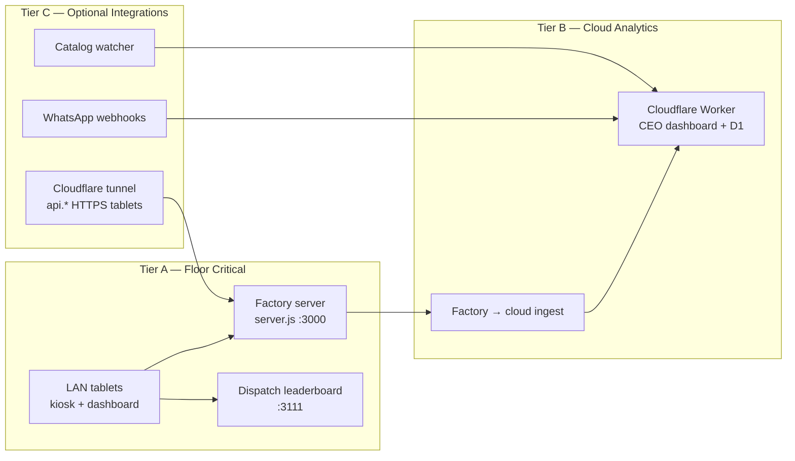

# AbaYa Track — Service Level Objectives & Agreements

> **Audience:** founders, operators, and Pro-tier customers.  
> **Companion docs:** [LICENSE_AGREEMENT.md](LICENSE_AGREEMENT.md) · [SYSTEM_DESIGN.md](SYSTEM_DESIGN.md) · [OBSERVABILITY.md](OBSERVABILITY.md) · [OPERATIONS_RUNBOOK.md](OPERATIONS_RUNBOOK.md)

This document defines **what we measure (SLO)**, **what we promise (SLA)**, and **how we prove it**. It is written for a hybrid-edge factory system where **floor operations must survive cloud outages**.

---

## 1. Definitions

| Term | Meaning |
|------|---------|
| **SLI** (Service Level Indicator) | A measurable signal — e.g. “`GET /api/state` returns 200 within 500 ms.” |
| **SLO** (Service Level Objective) | Internal target for an SLI over a rolling window — e.g. 99.5% of requests succeed in 30 days. |
| **SLA** (Service Level Agreement) | Contractual commitment to the customer, usually stricter than internal SLO and backed by credits. |
| **Error budget** | `100% − SLO`. When budget is exhausted, feature work pauses until reliability is restored. |
| **MTTA** | Mean time to acknowledge an incident. |
| **MTTR** | Mean time to restore service (not root-cause fix). |

**Golden rule:** SLO ≤ what engineering can sustain · SLA ≤ SLO − safety margin.

Recommended safety margin for customer SLAs: **0.3–0.5 percentage points** below internal SLO (e.g. internal 99.9% → contractual 99.5%).

---

## 2. Service boundaries

AbaYa Track is not one monolith. SLIs are scoped per **lane** so we do not over-promise on optional surfaces.

| Lane | Components | User impact if down | Contract tier |
|------|------------|---------------------|---------------|
| **A — Floor critical** | `server.js`, dispatch server, LAN connectivity | Production stops tracking; tablets cannot start/finish work | **All paid tiers** |
| **B — Cloud analytics** | Worker, D1, CEO dashboard, ingest queue | Owner loses remote visibility; floor still runs | Standard + Pro |
| **C — Optional** | WhatsApp ingest, catalog watcher, tunnel, Tailscale | Convenience features degrade; floor still runs on LAN | Feature-specific add-ons |

**Local-first contract (non-negotiable):** Lane A must operate with **zero dependency** on Lane B. Cloud downtime is **not** a floor outage.

---

## 3. Critical user journeys (CUJs)

Every SLI maps to a journey, not a server ping.

| ID | Journey | Primary SLI | Owner process |
|----|---------|-------------|---------------|
| **J1** | Operator starts/finishes work on kiosk tablet | Socket/REST success + p95 latency | `server.js` |
| **J2** | Supervisor sees live floor on LAN dashboard | Realtime or poll fallback freshness ≤ 10 s | `server.js` |
| **J3** | Material dispatch appears on floor leaderboard | Invoice visible ≤ 60 s after ingest | `dispatch-server` |
| **J4** | CEO views analytics remotely | `/api/state` availability + p95 latency | Cloudflare Worker |
| **J5** | Factory events reach cloud within SLA | Ingest success ≤ 5 min after reconnect | `pushToCloudflare` + queue drain |
| **J6** | Supplier order via WhatsApp → floor | End-to-end ≤ 120 s (p95) | Worker + dispatch bridge |
| **J7** | Catalog update from office Excel | Published ≤ 10 min after file drop | catalog-watcher |

---

## 4. Internal SLOs (engineering targets)

Rolling measurement window: **30 calendar days**, unless noted.

### 4.1 Lane A — Floor critical

| SLI | SLO target | Measurement |
|-----|------------|-------------|
| Factory server process uptime | **99.9%** | PM2 `pm_uptime` + synthetic `GET /api/state` every 60 s from factory host |
| Dispatch server process uptime | **99.9%** | PM2 + `GET /health` on `:3111` every 60 s |
| Kiosk start/finish RPC success rate | **99.95%** | SkyWalking trace success on Socket.IO handlers (or server counter) |
| `GET /api/state` availability (LAN) | **99.9%** | Synthetic probe from factory host |
| `GET /api/state` p95 latency (LAN) | **< 300 ms** | SkyWalking / synthetic probe |
| Realtime dashboard freshness | **≤ 10 s** for 99% of 5-min windows | Compare socket event ts vs wall clock |
| Data loss on factory restart | **0 sessions** after graceful PM2 restart | Post-reboot validation checklist (OPERATIONS_RUNBOOK §6A) |
| SQLite snapshot success | **99.5%** scheduled runs | `snapshot-failure` alert absence + snapshot meta |

**Error budget (Lane A):** 43.2 min downtime / 30 days at 99.9%.

### 4.2 Lane B — Cloud analytics

| SLI | SLO target | Measurement |
|-----|------------|-------------|
| CEO dashboard availability | **99.5%** | Cloudflare Worker `/api/health` synthetic (1 min interval) |
| `GET /api/state` p95 (edge) | **< 800 ms** | Synthetic + PERFORMANCE-CHECKLIST smoke |
| Factory ingest delivery (when factory online) | **99% within 5 min** | `/api/ceo-ingest-status` queue age |
| Ingest queue backlog duration | **< 15 min** per event (p95) | `backlogSinceMs` metric |
| Reconciliation tick success | **99%** of scheduled ticks | `reconcile.status.lastResult` |
| D1 read/write error rate | **< 0.1%** | Worker logs + Cloudflare analytics |

**Error budget (Lane B):** 3.6 h downtime / 30 days at 99.5%.

### 4.3 Lane C — Optional integrations

| SLI | SLO target | Measurement |
|-----|------------|-------------|
| WhatsApp webhook 2xx response | **99.5%** | Worker webhook logs |
| WhatsApp → leaderboard E2E | **95% within 120 s** | `dispatch_invoices.created_at` − webhook ts |
| Catalog publish after Excel drop | **99% within 10 min** | Watcher log + catalog version ts |
| Tunnel (`api.*`) availability | **99%** when enabled | Worker `/dispatch/tunnel-health` probe |
| Tunnel WebSocket upgrade success | **99%** | Synthetic `wss://` handshake |

Lane C SLOs are **best-effort** on Starter; Standard/Pro may attach SLA only when the feature is explicitly purchased.

---

## 5. Customer-facing SLA by subscription tier

Aligns with [PRODUCTIZATION-ROADMAP.md](PRODUCTIZATION-ROADMAP.md) §4.

### 5.1 Starter — $99/mo

| Commitment | SLA |
|------------|-----|
| Lane A floor server availability | **99.0%** / month |
| Support response (business hours, GST) | **2 business days** |
| Planned maintenance notice | **72 hours** |
| Service credits | None |

### 5.2 Standard — $249/mo

| Commitment | SLA |
|------------|-----|
| Lane A floor availability | **99.5%** / month |
| Lane B CEO dashboard availability | **99.0%** / month |
| Support response (business hours, GST) | **1 business day** |
| Sev-1 acknowledgment | **4 business hours** |
| Planned maintenance notice | **48 hours** |
| Service credits | None (support priority only) |

### 5.3 Pro — $599/mo

| Commitment | SLA |
|------------|-----|
| Lane A floor availability | **99.9%** / month |
| Lane B CEO dashboard availability | **99.5%** / month |
| WhatsApp ingest availability (if licensed) | **99.5%** / month |
| Support response | **4 hours** (24×5 GST) |
| Sev-1 acknowledgment | **1 hour** |
| Sev-1 restoration target | **4 hours** (Lane A), **8 hours** (Lane B) |
| Planned maintenance notice | **24 hours** |
| Monthly uptime report | Included |
| Dedicated SkyWalking namespace | Included |

#### Pro service credits (monthly uptime)

Credits apply to **the following month’s subscription fee**, capped at **30%** of that fee.

| Monthly uptime (Lane A) | Credit |
|-------------------------|--------|
| 99.0% – 99.89% | 10% |
| 98.0% – 98.99% | 20% |
| < 98.0% | 30% |

Lane B credits (CEO dashboard only): half the above percentages when Lane A met its SLA.

**Credit request:** customer opens ticket within **10 business days** of month end with tenant ID. We respond within **5 business days** with calculation.

---

## 6. Incident severity & response

Business hours default: **Sun–Thu 09:00–18:00 GST** (configurable per tenant in Pro).

| Severity | Definition | Examples | Pro MTTA | Pro MTTR target |
|----------|------------|----------|----------|-----------------|
| **Sev-1** | Lane A down or widespread data loss risk | All tablets offline; factory server crash loop | 1 h | 4 h |
| **Sev-2** | Major degradation, workaround exists | Dashboard stale > 5 min; ingest backlog > 1 h | 4 h | 8 h |
| **Sev-3** | Partial / optional feature | CEO dashboard slow; WhatsApp delay | 1 business day | 3 business days |
| **Sev-4** | Cosmetic / question | UI typo, doc error | 2 business days | Next release |

**Status updates:** Sev-1 every **2 hours** until mitigated; Sev-2 every **1 business day**.

Security incidents follow [SECURITY.md](../SECURITY.md) timelines (24 h ack, 72 h triage) in parallel.

---

## 7. Exclusions (standard SaaS carve-outs)

The following **do not** count against uptime SLAs:

1. **Customer-controlled infrastructure:** factory PC power loss, Windows updates, disk full, antivirus blocking ports, LAN switch failure, tablet hardware, misconfigured firewall (see [VERIFY-LAN-FIREWALL.ps1](../install/VERIFY-LAN-FIREWALL.ps1)).
2. **Third-party outages outside our control:** Meta WhatsApp API, Zhipu AI, Cloudflare global incident (status.cloudflare.com), ISP outage at factory or customer office.
3. **Scheduled maintenance** announced per tier notice period, max **4 hours/month** Pro, **2 hours/month** Standard.
4. **Force majeure** (UAE law): natural disaster, government order, war, epidemic.
5. **Customer misconfiguration:** wrong `CF_INGEST_SECRET`, expired JWT, deleted D1 (unless caused by our tooling bug).
6. **Beta / preview features** explicitly labeled.
7. **Abuse or rate-limit triggers** on ingest endpoints.

**Important:** Lane B outage during factory LAN-only operation is **excluded from Lane A credits** but may still trigger Lane B credits on Pro.

---

## 8. How we measure (observability contract)

### 8.1 Factory host (Lane A)

| Signal | Source | Retention |
|--------|--------|-----------|
| Process uptime | PM2 + `yarn pm2:status` HTTP probe | PM2 logs in `data/pm2-logs/` |
| Request latency & errors | Apache SkyWalking agent on `server.js` + dispatch | BanyanDB (local Docker) — 7 days minimum |
| Ingest queue health | `GET /api/ceo-ingest-status` | SQLite + alert emails |
| Snapshot integrity | `yarn snapshot:verify` | HMAC chain in `data/sqlite-snapshots/` |

### 8.2 Cloud (Lane B)

| Signal | Source | Retention |
|--------|--------|-----------|
| Edge availability | Synthetic monitor → `/api/health` | Cloudflare Workers analytics |
| API latency | Worker logs + synthetic | 30 days |
| Tunnel reachability | `/dispatch/tunnel-health` cron | D1 `tunnel_probes` table |

### 8.3 Monthly SLA report (Pro)

Delivered by **5th business day** of the following month:

1. Uptime % per lane (table + chart)
2. Error budget burn (remaining %)
3. Incidents (Sev-1/2) with timeline
4. Top 3 latency regressions (SkyWalking)
5. Ingest backlog peaks
6. Planned maintenance log

---

## 9. Error-budget policy

When a lane’s **30-day error budget is exhausted**:

1. **Freeze** non-reliability feature work for that lane until budget resets or SLO recovered for **7 consecutive days**.
2. **Mandatory** post-incident review within **5 business days** (blameless, 5-whys or equivalent).
3. **Pro customers** receive proactive notice if budget < **20%** remaining mid-month.

---

## 10. Implementation checklist (close the gaps)

These items turn this document from policy into proof.

| Priority | Action | Unblocks SLI |
|----------|--------|--------------|
| P0 | Add `GET /api/health` to root `server.js` (referenced by kiosk + LAN scripts but not yet implemented) | J1, J2 synthetic probes |
| P0 | External synthetic monitor (UptimeRobot / Cloudflare Health Checks) for Worker `/api/health` | Lane B SLA |
| P1 | SkyWalking dashboards for J1/J3 p95 + error rate | Latency SLOs |
| P1 | Export PM2 uptime to monthly CSV script | Lane A SLA report |
| P1 | D1 table or R2 export for monthly SLA rollup | Pro reporting |
| P2 | WhatsApp E2E latency metric in Worker handler | J6 |
| P2 | Customer-facing status page (`status.abaya-track.com`) | Transparency |

---

## 11. Customer annex (attach to Pro contracts)

Copy the block below into Pro order forms or MSAs.

---

### Annex A — Service Level Agreement (Pro Tier)

**Provider:** Licensor of AbaYa Track  
**Customer:** Licensee as defined in the Software License Agreement  
**Effective:** Upon Pro subscription start  
**Measurement month:** Calendar month, GST

**1. Covered services**

- Factory floor server (Lane A): kiosk, LAN dashboard, local APIs on the licensed factory host.
- Cloud CEO dashboard (Lane B): `dashboard.<tenant-domain>` Worker + D1 analytics.
- WhatsApp material ingest (Lane C): only if WhatsApp Business add-on is active.

**2. Availability commitments**

| Service | Monthly uptime SLA |
|---------|-------------------|
| Lane A | 99.9% |
| Lane B | 99.5% |
| WhatsApp ingest (if licensed) | 99.5% |

Uptime = `(total_minutes − excluded_downtime − incident_minutes) / total_minutes`.

**3. Support**

- Channels: email + WhatsApp Business (Standard/Pro line).
- Sev-1 response: 1 hour (24×5 GST).
- Sev-1 restoration target: 4 hours (Lane A), 8 hours (Lane B).

**4. Service credits**

As defined in §5.3 of `docs/SLA_SLO.md`. Credits are the **sole and exclusive** monetary remedy for SLA breach.

**5. Exclusions**

As defined in §7 of `docs/SLA_SLO.md`.

**6. Local-first guarantee**

Cloud analytics unavailability does **not** constitute a Lane A breach if factory LAN services remain available to tablets on the licensed network.

---

## 12. Review cadence

| Review | When | Owner |
|--------|------|-------|
| SLO target sanity | Quarterly | Engineering |
| SLA tier pricing vs cost | Semi-annual | Founders |
| Post-incident SLO adjustment | After any Sev-1 | Engineering + Support |
| Customer annex legal | Before first Pro signature | Legal counsel (DIFC) |

---

*Version 1.0 — 2026-06-19. Update when instrumentation in §10 is completed or tier pricing changes.*
