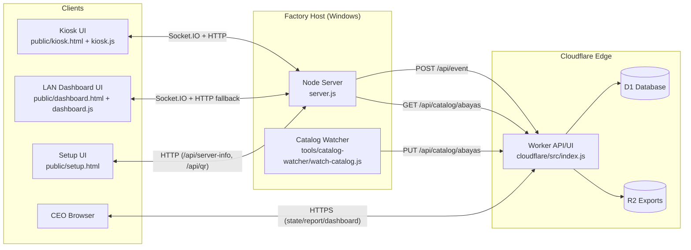
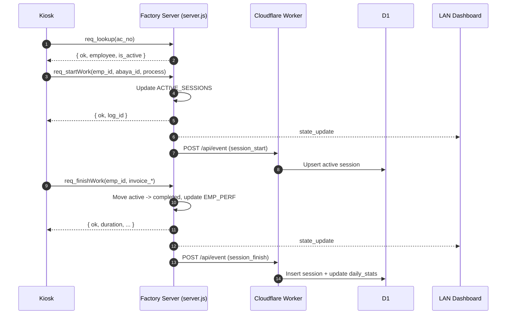
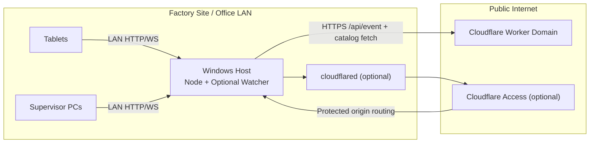

# AbaYa Track System Design (As-Built)

## 1) Purpose and Scope

This document describes the current system design of the `famousabaya` codebase as implemented today.  
It covers runtime components, interfaces, data contracts, deployment and operations, trust boundaries, and architectural risks.

Out of scope: future product requirements not represented in code.

---

## 2) System Context

AbaYa Track is a hybrid factory-floor and cloud analytics system:

- Factory floor runtime is a Node/Express + Socket.IO app (`server.js`) serving kiosk/dashboard/setup UIs from `public/`.
- Remote analytics and reporting run on a Cloudflare Worker (`cloudflare/src/index.js`) backed by D1 and R2.
- Optional office automation (`tools/catalog-watcher`) ingests Excel exports and publishes catalog updates.
- Installation and daily operations are Windows-first via batch/PowerShell scripts under `install/` and `scripts/`.

Primary user groups:

- Factory operators (kiosk interaction, session start/finish)
- Supervisors on LAN dashboard
- Executives on cloud dashboard/reports
- IT/admin staff maintaining host/tunnel/deployment

---

## 3) Architectural Style

Current style is a split monolith:

- **Local monolith (factory):**
  - Single Node process
  - In-memory state for active sessions and local history
  - Real-time updates via Socket.IO
- **Edge/cloud service (Cloudflare Worker):**
  - API + dashboard HTML
  - Persistent analytics/state in D1
  - Daily export artifacts in R2
- **Auxiliary ingestion process (catalog-watcher):**
  - Separate Node process
  - File-system driven batch ingestion

Consistency model is eventual across local and cloud boundaries.

---

## 4) Component Inventory

## 4.1 Runtime Components

- `server.js`
  - Bootstraps Express app, HTTP server, Socket.IO
  - Serves static `public/` assets
  - Exposes REST APIs for state/catalog/setup/QR
  - Handles realtime lifecycle events (`req_lookup`, `req_startWork`, `req_finishWork`)
  - Pulls catalog from cloud and optionally from local XLSX
  - Pushes session events to Cloudflare (best effort)

- `public/kiosk.html` + `public/kiosk.js` + `public/data.js`
  - Kiosk SPA-style flow for scan/identify/work selection/start/finish
  - Uses Socket.IO RPC-style events
  - Reads catalog over HTTP and reacts to `catalog_update`

- `public/dashboard.html` + `public/dashboard.js` + `public/data.js`
  - Live dashboard with socket primary and HTTP fallback polling
  - Renders KPIs/charts/recent activity and exports

- `public/setup.html`
  - Setup utility for generating onboarding QR codes from server LAN IP/port
  - Uses `/api/server-info` and `/api/qr`

- `cloudflare/src/index.js`
  - Cloud API and CEO surface
  - Ingest endpoint for factory event replication
  - Reporting and state query endpoints for CEO dashboard
  - Catalog read/write endpoint backed by D1
  - Scheduled export to R2

- `tools/catalog-watcher/watch-catalog.js` + `catalog-parse.js`
  - Watches configured folder tree
  - Parses/normalizes catalog rows from Excel
  - Pushes catalog to worker or local server with ingest secret

## 4.2 Platform and Build Components

- `package.json`
  - Node >= 18
  - Yarn 4 (`packageManager`)
  - Runtime deps: `express`, `socket.io`, `cors`, `dotenv`, `qrcode`, `xlsx`
- `scripts/build-release.ps1`
  - Builds portable ZIP release for offline-friendly Windows install
- `install/*.bat`
  - Installation, launch, cloud deploy helpers, firewall opening

---

## 5) Source Tree by Functional Domain

- `server.js`: local runtime + API + socket orchestration
- `public/`: browser clients and static assets
- `cloudflare/`: edge runtime, schema, migrations, deploy scripts
- `tools/catalog-watcher/`: external catalog ingestion automation
- `install/`: Windows runbook automation
- `docs/`: operations and deployment guides
- `scripts/`: packaging and utility scripts

---

## 6) Data Ownership and State Model

## 6.1 Local Factory State (in-memory)

Owned by `server.js`:

- `ACTIVE_SESSIONS`: open sessions keyed by employee
- `COMPLETED_LOGS`: recent completed work logs
- `EMP_PERF`: aggregated per-employee counters/performance
- Catalog cache and version metadata

Characteristics:

- Volatile memory only
- Fast local reads/writes
- Lost on process restart

## 6.2 Cloud Persistent State

Owned by Cloudflare Worker (D1 + R2):

- `sessions`, `active_sessions`, `daily_stats`
- `abaya_catalog`, `catalog_meta`
- Daily text exports in R2 (scheduled workflow)

Characteristics:

- Durable analytics ledger
- Serves CEO reports/state views
- Eventual synchronization from factory pushes

## 6.3 Static/Config Data

- `.env` and `.env.example` for local runtime behavior
- `cloudflare/wrangler.toml` for worker bindings and schedule
- `tools/catalog-watcher/config.json` for office watcher behavior
- Client-side baseline constants in `public/data.js`

---

## 7) API and Event Interface Design

## 7.1 Factory HTTP API (`server.js`)

- `GET /api/catalog/abayas`
  - Returns catalog cache + version
- `GET /api/state`
  - Returns realtime snapshot (`active`, `logs`, `perf`, timestamp)
- `GET /api/employees`
  - Returns employee directory for tooling/lookup scenarios
- `PUT /api/catalog/abayas`
  - Replaces catalog (requires `X-Ingest-Secret`, supports array or `{ abayas }`)
- `GET /api/server-info`
  - Returns LAN IP candidates and effective port
- `GET /api/qr?url=&size=`
  - Returns generated QR SVG
- `GET /setup`
  - Redirects to `setup.html`

## 7.2 Factory Socket.IO Contract

- Server emits:
  - `state_update`
  - `catalog_update`
- Client requests (ack callbacks):
  - `req_lookup(ac_no)`
  - `req_startWork({ emp_id, abaya_id, process })`
  - `req_finishWork({ emp_id, invoice_count?, invoice_serial? })`

## 7.3 Cloudflare Worker API

- `POST /api/event` (ingest)
- `GET /api/state` (CEO snapshot)
- `GET /api/report?type=daily|weekly|monthly`
- `GET /api/catalog/abayas` (catalog read)
- `PUT /api/catalog/abayas` (catalog replace with ingest secret)
- `GET /` (CEO HTML/login surface)
- Scheduled trigger for EOD export

---

## 8) End-to-End Runtime Flows

## 8.1 Session Start/Finish (Factory-first)

1. Kiosk identifies employee (`req_lookup`).
2. Kiosk starts work (`req_startWork`).
3. Server mutates in-memory active state and broadcasts `state_update`.
4. Server asynchronously pushes `session_start` to cloud ingest.
5. On completion, kiosk sends `req_finishWork`.
6. Server moves record from active to completed, updates perf, broadcasts.
7. Server asynchronously pushes `session_finish` to cloud ingest.
8. Worker writes/updates D1 tables for active/history/statistics.

## 8.2 Catalog Lifecycle

Multiple writer/read paths exist:

- Worker-hosted canonical catalog in D1
- Factory polling from worker (`/api/catalog/abayas`) on interval
- Office watcher pushing catalog to worker (or optionally local server)
- Optional local XLSX import into factory memory
- Local secure `PUT /api/catalog/abayas` direct update path

Operationally this is last-writer-wins by update path and timing.

## 8.3 Dashboard Data Path

- LAN dashboard: socket-first real-time updates from factory; HTTP fallback to `/api/state`.
- CEO dashboard: polling Cloudflare Worker `/api/state` and reports over HTTPS with token.

---

## 9) Trust Boundaries and Security Posture

## 9.1 Boundaries

- Browser clients ↔ Factory Node server (LAN/private)
- Factory Node server ↔ Cloudflare Worker (public internet)
- Office watcher ↔ Cloudflare/Factory ingest endpoints
- CEO browser ↔ Cloudflare Worker (public HTTPS)

## 9.2 Current Controls

- Secret-protected ingestion for catalog and event APIs (`X-Ingest-Secret`/worker secret)
- Token-gated CEO endpoints in worker (`CEO_TOKEN`)
- Optional Cloudflare Tunnel + Access documented for remote node exposure

## 9.3 Current Gaps (as-built)

- Factory socket and several read APIs are unauthenticated by default.
- CORS/socket origin are permissive (`*`) on local runtime.
- URL query token use in CEO polling path leaks risk via logs/history/referrer.
- Shared-secret model without rotation/audit trail.
- Potential cross-surface exposure when static assets are globally served.

---

## 10) Reliability and Failure Semantics

## 10.1 Positive Design Choices

- Local floor operations do not block on cloud availability.
- Dashboard has socket + HTTP fallback model.
- Catalog refresh includes periodic retry behavior.

## 10.2 Failure Modes

- Local server restart loses in-memory state/history.
- Cloud push failures are logged but non-blocking (possible analytics drift).
- Multi-source catalog updates can race and overwrite each other.
- Network instability can cause eventual consistency lag.

## 10.3 Recovery Paths

- Relaunch via `install/LAUNCH-ALL.bat` and related scripts.
- Tunnel diagnostics via docs + check scripts.
- Watcher retries via debounce/daily sync and file-resident backlog.

---

## 11) Deployment and Operations Design

## 11.1 Windows-first Operational Model

- Install: `install/INSTALL.bat`
- Run: `install/LAUNCH-ALL.bat`
- Optional cloud deploy: `install/DEPLOY-CEO-CLOUD.bat` (`cloudflare/DEPLOY.ps1`)
- Optional firewall convenience: `install/OPEN-CEO-DASHBOARD.bat`

## 11.2 Runtime Process Topology

- Process A: `yarn node server.js` (factory server)
- Process B (optional): `yarn node watch-catalog.js` (catalog watcher)
- Process C (optional external service): `cloudflared` tunnel connector

## 11.3 Configuration Surfaces

- Root `.env` (factory runtime and CF integration)
- Worker secrets/bindings (Wrangler + Cloudflare secrets)
- Watcher JSON config

## 11.4 Observability

- Primary observability is console logs.
- No centralized metrics/APM/log aggregation in-repo.

---

## 12) Performance and Scale Characteristics

## 12.1 Current Scale Envelope (inferred)

- Designed for single-factory, single-node deployment.
- In-memory operations provide low-latency local interaction.
- Socket broadcast model is straightforward for moderate LAN client counts.

## 12.2 Bottlenecks/Constraints

- Single process and memory state limit horizontal scale.
- No external session/state store for shared realtime state.
- No explicit queue between local events and cloud ingest.
- Browser payload rendering can become heavy if logs grow unbounded in memory.

---

## 13) Configuration and Port Consistency Risks

There is configuration drift across code/scripts/docs:

- Code default often aligns to port `3000`.
- Some scripts/docs still reference `3000`.
- Deploy script may seed `.env` values that diverge from runtime defaults.

This mismatch can break tunnel ingress, firewall assumptions, and operator runbooks.

---

## 14) Technical Debt Map

- Domain constants duplicated across server/client/watcher/worker surfaces.
- Kiosk has dual socket creation behavior in page/script combination.
- Monolithic client HTML/CSS/JS without modular build pipeline.
- PWA metadata exists but full offline service-worker strategy is not implemented.
- Security model heavily trusts network boundary and shared secrets.

---

## 15) Target-State Architecture (Recommended)

## 15.1 Principles

- Single source of truth per domain (catalog, employees, process taxonomy)
- Explicit trust model (authN/authZ by surface)
- Durable local event ledger with replay capability
- Deterministic config profile across docs/scripts/runtime

## 15.2 Recommended Phased Evolution

### Phase 1 (Hardening, low disruption)

- Normalize port/config defaults and docs.
- Add auth gate for factory socket + sensitive APIs.
- Restrict CORS/origin by configuration.
- Move CEO token to header/cookie flow; avoid query token propagation.
- Add structured logs and minimal health endpoints.

### Phase 2 (Consistency and durability)

- Persist local events (SQLite or append-only file) with startup replay.
- Introduce idempotent event IDs between local server and cloud ingest.
- Consolidate domain constants into shared schema module.
- Add catalog write governance (single writer or conflict strategy).

### Phase 3 (Scalability/operability)

- Externalize realtime state store if multi-instance needed.
- Add metrics dashboards and alerting for ingest failure rates.
- Service-manage runtime processes for unattended operation.

---

## 16) Verification Checklist for This Design

To keep this design current, validate on each major change:

- Endpoint inventory still matches `server.js` and worker routes.
- Socket event contract unchanged or versioned.
- `.env.example`, scripts, and docs agree on key runtime defaults.
- Watcher config schema and README remain synchronized.
- Security controls documented here match effective runtime behavior.

---

## 17) Decision Log Snapshot (Current)

- Local runtime prioritizes availability and simplicity over strict durability.
- Cloud analytics is asynchronous, not transactionally coupled to floor actions.
- Windows batch-based operations optimize for non-developer administration.
- Catalog management supports multiple ingestion paths for operational flexibility, with consistency trade-offs.

---

## 18) Appendix: Key Files

- `server.js`
- `package.json`
- `public/kiosk.html`
- `public/kiosk.js`
- `public/dashboard.html`
- `public/dashboard.js`
- `public/setup.html`
- `public/data.js`
- `cloudflare/src/index.js`
- `cloudflare/wrangler.toml`
- `cloudflare/schema.sql`
- `tools/catalog-watcher/watch-catalog.js`
- `tools/catalog-watcher/catalog-parse.js`
- `tools/catalog-watcher/config.example.json`
- `install/INSTALL.bat`
- `install/LAUNCH-ALL.bat`
- `install/OPEN-CEO-DASHBOARD.bat`
- `install/DEPLOY-CEO-CLOUD.bat`
- `docs/INSTALL_WINDOWS.md`
- `docs/REMOTE_ACCESS.md`
- `docs/DEPLOYMENT_KIOSK_FINGERPRINT.md`

---

## 19) Mermaid Diagrams

## 19.1 High-Level Component Diagram



## 19.2 Session Lifecycle Sequence



## 19.3 Catalog Update Flow

```mermaid
flowchart TD
    XLSX["Excel Catalog Files"] --> Watcher["Catalog Watcher"]
    Watcher -->|"PUT /api/catalog/abayas + X-Ingest-Secret"| Worker["Cloudflare Worker"]
    Worker --> D1[("D1 abaya_catalog")]

    Worker -->|"GET /api/catalog/abayas (poll interval)" Server["Factory Server"]
    Server -->|"io.emit('catalog_update')" Kiosk["Kiosk UI"]
    Server -->|"io.emit('catalog_update')" Dash["LAN Dashboard"]
    Kiosk -->|"GET /api/catalog/abayas"| Server
    Dash -->|"GET /api/catalog/abayas"| Server

    Admin["Admin/Tooling"] -->|"PUT /api/catalog/abayas"| Server
    LocalXLSX["Local XLSX path (.env)"] --> Server
```

## 19.4 Deployment Topology


