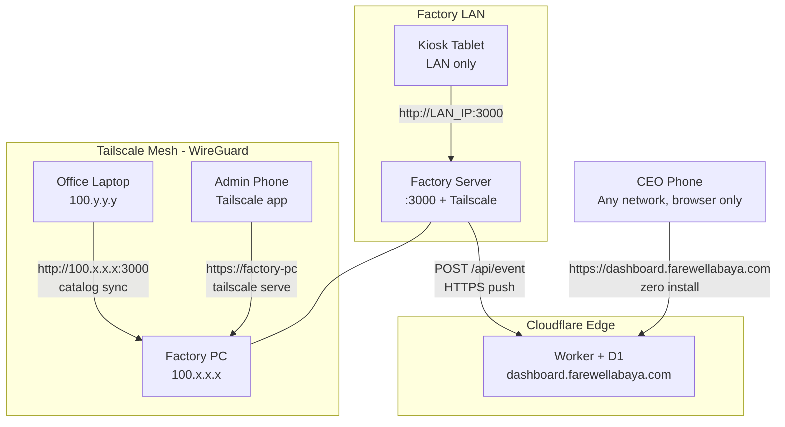
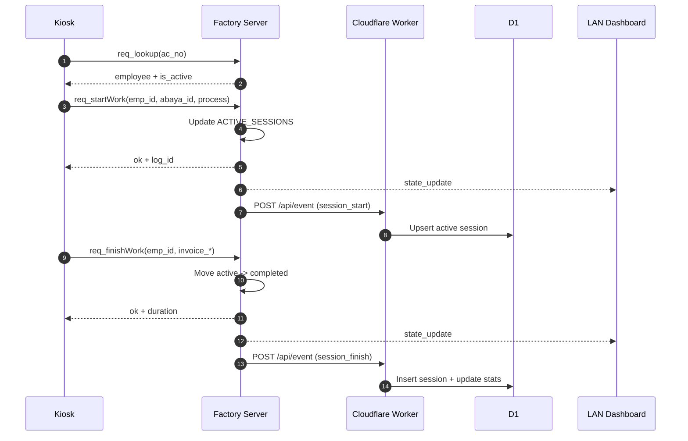
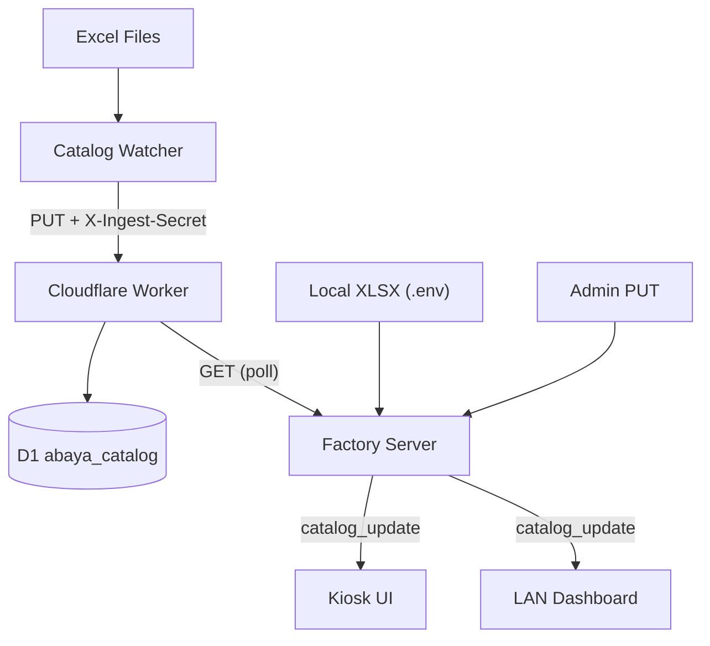
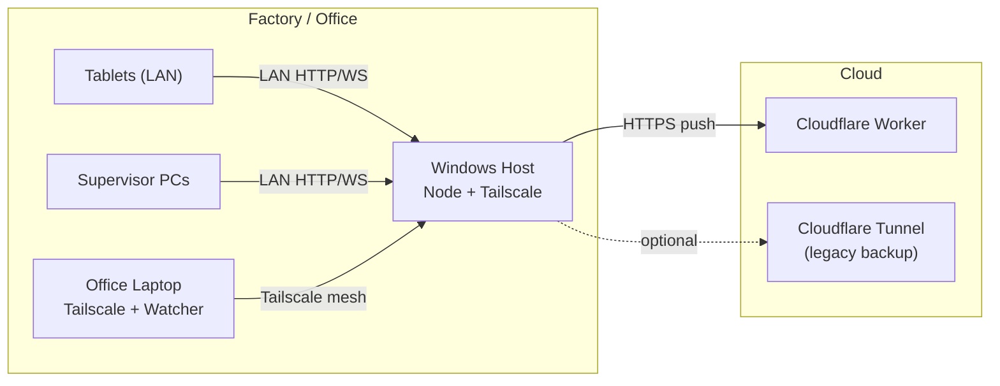

# AbaYa Track — System Design

## 1) System Context

AbaYa Track is a hybrid factory-floor and cloud analytics system:

- **Factory server** (`server.js`): Node/Express + Socket.IO, serves kiosk/dashboard/setup UIs, holds in-memory state.
- **Cloudflare Worker** (`cloudflare/src/index.js`): CEO analytics surface backed by D1 and R2.
- **Catalog watcher** (`tools/catalog-watcher`): ingests Excel exports, publishes catalog updates.
- **Windows scripts** (`install/`, `scripts/`): installation, daily launch, packaging, cloud deploy.

User groups: factory operators (kiosk), supervisors (LAN dashboard), executives (CEO cloud dashboard), IT/admin.

---

## 2) Network Architecture — Three Lanes



| Lane | Path | Friction |
|------|------|----------|
| **CEO Phone** | Browser -> `dashboard.farewellabaya.com` -> Cloudflare Worker -> D1 | Zero. No app install. |
| **Kiosk Tablet** | Browser -> `kiosk.farewellabaya.com` (PWA) -> Factory server via Socket.IO | Zero. Add to home screen once. |
| **Admin / Office** | Tailscale -> `100.x.x.x:3000` or `https://factory-pc` | One-time Tailscale install. |

Cloudflare Tunnel is preserved as legacy backup (`config/cloudflared.config.yml`).

### Local-first contract (factory kiosk + LAN dashboard)

- **Single authoritative process:** `server.js` is the only backend required for floor operations. It keeps in-memory sessions, serves static UIs, and exposes Socket.IO plus REST on one TCP port (default 3000).
- **Same-origin floor UIs:** Kiosk (`/kiosk.html`) and supervisor dashboard (`/dashboard.html`) are served from the factory host; realtime and REST use that host (WAN not required for core operation).
- **Live updates:** Dashboard prefers Socket.IO; on disconnect it **polls `GET /api/state` on the same origin** every few seconds. Kiosk traffic is Socket-first to the same host.
- **Cloud is optional:** `POST` to the Cloudflare Worker (`pushToCloudflare`) runs only when `CF_WORKER_URL` and `CF_INGEST_SECRET` are set; it uses a short timeout and **never participates in request/response** for kiosk start/finish. CEO analytics at `dashboard.farewellabaya.com` is a **separate** surface and may be offline without affecting the factory LAN.
- **Installation shape:** First-time setup is **`node install/setup.cjs`** (or `yarn setup` / `install\INSTALL.bat`) — one Node entrypoint instead of many small PowerShell installers. Optional scripts (tunnel, Tailscale, deploy, startup registration) remain for IT automation only.

---

## 3) Component Inventory

### Runtime

- **`server.js`** — Express + Socket.IO. Serves `public/` assets. REST APIs for state/catalog/setup/QR. Realtime lifecycle events. Pushes to Cloudflare (best effort).
- **`public/kiosk.html` + `kiosk.js`** — Floor kiosk SPA. Socket.IO RPC. Catalog display.
- **`public/dashboard.html` + `dashboard.js`** — Live dashboard. Socket primary, HTTP fallback polling.
- **`public/setup.html`** — QR code generator for tablet onboarding.
- **`cloudflare/src/index.js`** — Worker: ingest, CEO dashboard, reporting, catalog CRUD, scheduled R2 export.
- **`tools/catalog-watcher/watch-catalog.js`** — Folder watcher. Parses Excel, pushes catalog to Worker/server.

### Build / Ops

- `package.json` — Node >= 18, Yarn 4 PnP, `express`, `socket.io`, `cors`, `dotenv`, `qrcode`, `xlsx`. Scripts: `yarn setup` (first install), `yarn start`, `yarn deploy:all`.
- `install/setup.cjs` — **Primary Windows install:** Corepack, `yarn install` (root + catalog-watcher), `.env` bootstrap, Desktop shortcut (VBScript, no PowerShell).
- `install/LAUNCH-ALL.bat` — Daily start: optional `cloudflared`, then `yarn node server.js`, optional watcher.
- `scripts/build-release.ps1` — Portable ZIP for air-gapped copy (still uses `INSTALL.bat` → `setup.cjs` on target PC).
- Optional IT scripts: `install/SETUP-TAILSCALE.ps1`, `install/SETUP-CLOUDFLARE-TUNNEL-FACTORY-API.ps1`, `install/DEPLOY-ALL.ps1`, `install/REGISTER-STARTUP-SCHEDULER.ps1` (not required for core factory operation).

---

## 4) Data Ownership

### Local (in-memory, volatile)

`ACTIVE_SESSIONS`, `COMPLETED_LOGS`, `EMP_PERF`, catalog cache. Lost on restart.

### Cloud (D1 + R2, durable)

`sessions`, `active_sessions`, `daily_stats`, `abaya_catalog`, `catalog_meta`. Daily R2 exports. Eventual consistency from factory pushes.

### Config

`.env` (local runtime), `cloudflare/wrangler.toml` (Worker bindings), `tools/catalog-watcher/config.json` (watcher), `public/data.js` (client constants).

---

## 5) API Surface

### Factory HTTP (`server.js`)

| Method | Path | Purpose |
|--------|------|---------|
| GET | `/api/catalog/abayas` | Catalog cache + version |
| GET | `/api/state` | Realtime snapshot |
| GET | `/api/employees` | Employee directory |
| PUT | `/api/catalog/abayas` | Replace catalog (requires `X-Ingest-Secret`) |
| GET | `/api/server-info` | LAN IP + port |
| GET | `/api/qr?url=&size=` | QR SVG |
| GET | `/setup` | Redirect to setup.html |

### Factory Socket.IO

- Server emits: `state_update`, `catalog_update`
- Client requests: `req_lookup(ac_no)`, `req_startWork(...)`, `req_finishWork(...)`

### Cloudflare Worker

| Method | Path | Purpose |
|--------|------|---------|
| POST | `/api/event` | Factory ingest |
| GET | `/api/state` | CEO snapshot |
| GET | `/api/report?type=` | Daily/weekly/monthly |
| GET/PUT | `/api/catalog/abayas` | Catalog CRUD |
| GET | `/` | CEO HTML dashboard + login |

---

## 6) Session Lifecycle



---

## 7) Catalog Flow



Multiple writer paths. Last-writer-wins by timing.

---

## 8) Security Posture

**Controls:** `X-Ingest-Secret` on ingest APIs, `CEO_TOKEN` on Worker endpoints, optional Cloudflare Access on tunnel hostnames, Tailscale mesh encryption (WireGuard).

**Known gaps:** Factory socket/read APIs unauthenticated by default. CORS `*` on local runtime. CEO token in query string (log/referrer leak risk). No secret rotation or audit trail.

---

## 9) Reliability

**Good:** Local ops do not block on cloud. Dashboard uses same-origin socket + `GET /api/state` fallback. Catalog reload from disk/Excel is independent of Cloudflare. Cloud ingest is async with bounded timeout.

**Risks:** In-memory state is lost on process restart. Failed cloud pushes only affect CEO analytics, not kiosk correctness. Multi-writer catalog (watcher vs local XLSX vs Worker) can race. Single Node process means no horizontal scale on one host.

---

## 10) Deployment Topology



---

## 11) Source Tree

```
server.js              Local runtime + API + socket
public/                Browser clients and static assets
cloudflare/            Edge runtime, schema, migrations, deploy
tools/catalog-watcher/ External catalog ingestion
install/               setup.cjs + LAUNCH-ALL.bat + optional IT scripts
docs/                  Operations and deployment guides
scripts/               Packaging and utility scripts
config/                Cloudflare Tunnel template (legacy)
```

---

## 12) Technical Debt

- Domain constants duplicated across server/client/watcher/worker.
- Monolithic client HTML/CSS/JS (no build pipeline).
- Kiosk PWA uses a minimal service worker (shell cache only); factory `public` kiosk is fully online-within-LAN.
- Security trusts network boundary + shared secrets.
- In-memory state has no persistence or replay.
